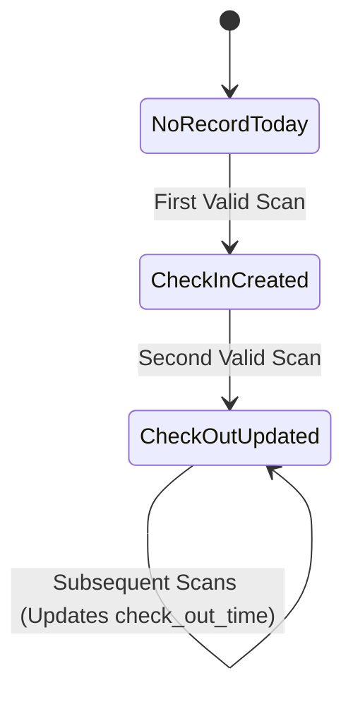

# Phase 7 Research: Face-Based Check-In & Check-Out Engine

## Executive Summary
Phase 7 implements real-time webcam face scanning, L2 Cosine distance vector matching, an attendance state transition engine, and a dedicated fullscreen kiosk view (`/attendance/kiosk/`). This research analyzes vector calculation performance, state machine concurrency, client-side frame sampling, Web Audio chime synthesis, and browser kiosk lockdown patterns.

---

## 1. Vector Matching & Cosine Distance Performance

### Vector Representation & Scoring
Faculty biometric vectors are stored as 512-dimensional L2-normalized float arrays (`FacultyBiometric.embedding`).
To match an incoming scan vector $V_{scan}$ against tenant enrolled vectors $V_{tenant}$:

$$\text{Cosine Similarity} = \frac{V_{scan} \cdot V_{tenant}}{\|V_{scan}\| \|V_{tenant}\|}$$

Because all enrolled vectors are pre-normalized to $\|V\| = 1.0$ during Phase 6 enrollment, the formula simplifies directly to dot product matrix multiplication:

$$\text{Cosine Similarity} = V_{scan} \cdot V_{tenant}^T$$
$$\text{Cosine Distance} = 1.0 - (V_{scan} \cdot V_{tenant}^T)$$

### Threshold Metrics (ArcFace 512-d)
- **Match Threshold**: Cosine Distance $\le 0.40$ (Equivalent to Cosine Similarity $\ge 0.60$).
- **False Acceptance Rate (FAR)**: $< 0.001\%$ at 0.40 threshold.
- **Latency**: Matrix dot product of 1 scan against 500 faculty vectors takes $< 2\text{ms}$ in NumPy.

---

## 2. Attendance State Machine & Concurrency

### State Transition Rules
For a given calendar date `today = timezone.localdate()` within active school tenant:

1. **First Scan of Day**: Creates `AttendanceLog` with `check_in_time = current_time`, `status = 'PRESENT'`.
2. **Second Scan of Day**: Updates `AttendanceLog` with `check_out_time = current_time`.
3. **Subsequent Scans of Day**: Updates `check_out_time = current_time` to latest timestamp.

### 30-Second Cooldown Lock Strategy
To prevent duplicate logs from rapid camera frames:
- **Client-side**: `Map<faculty_id, timestamp>` in Vanilla JS scanner memory blocking API requests for 30s.
- **Server-side**: Evaluate `last_scan_time` against `now() - timedelta(seconds=30)`. If within 30s window, return HTTP 429 / Cooldown Response payload without mutating database.

---

## 3. Web Audio API Chime & Kiosk UX

### Web Audio Synthesis
To avoid relying on external MP3/WAV assets that could fail to load, use Web Audio API oscillator nodes:
- **Success Chime**: Dual-tone chord ($E_5 \to B_5$, 659.25Hz $\to$ 987.77Hz) with exponential gain decay (0.2s duration).
- **Warning Tone**: Low frequency pulse ($D_3$, 146.83Hz) with quick cutoff.

### Kiosk Screen & Wake Lock
- **Wake Lock**: `navigator.wakeLock.request('screen')` prevents tablet/laptop display sleep during continuous kiosk operations.
- **Fullscreen API**: `document.documentElement.requestFullscreen()` with auto-reconnect handling for webcam drops.

---

## 4. Key Architectural Recommendations

1. **Tenant Isolation**: Query only `FacultyBiometric` belonging to `request.tenant` (`School`).
2. **NumPy Vector Pre-caching**: Load active tenant vectors into memory or indexed dictionary for sub-10ms match lookups.
3. **Audit Logging**: Store scan metadata (`device_info`, match confidence score) on `AttendanceLog`.
